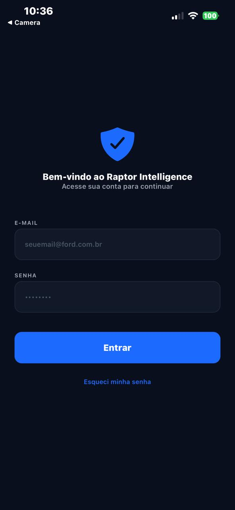
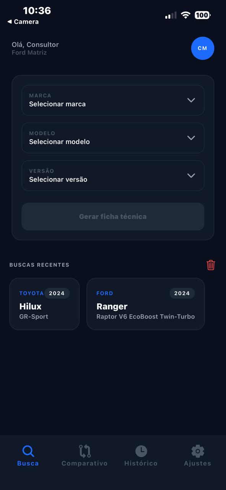
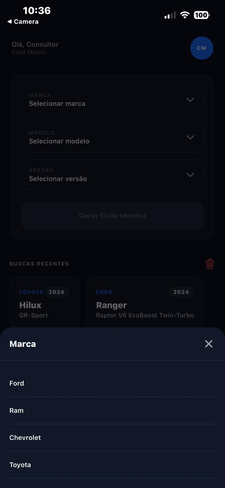
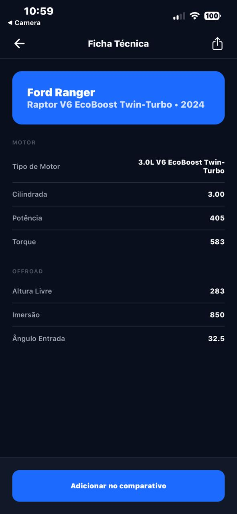
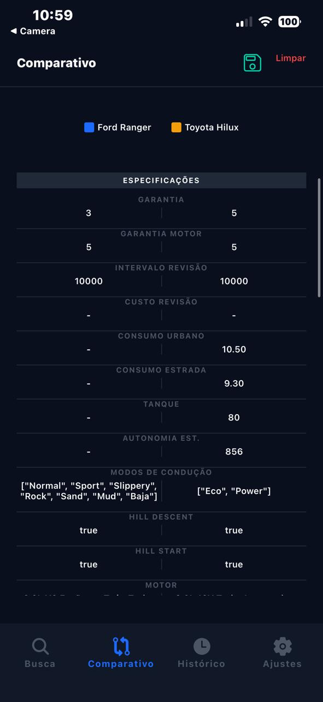
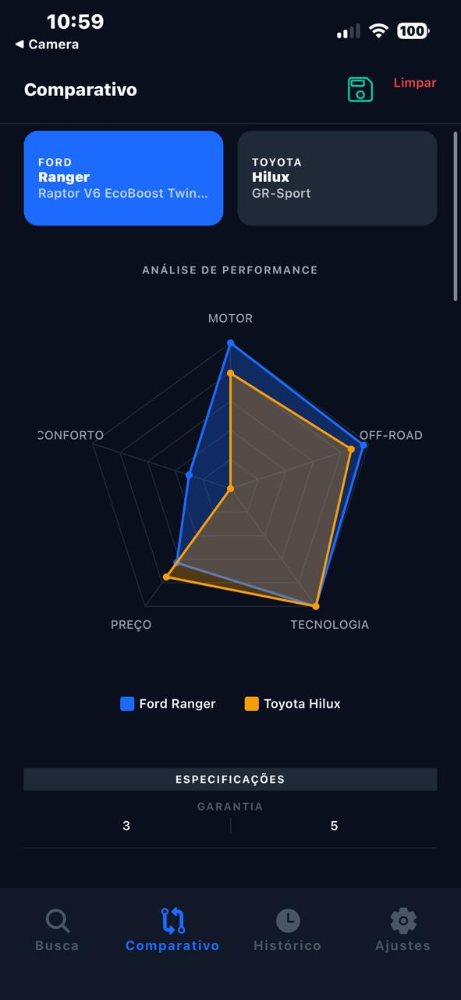
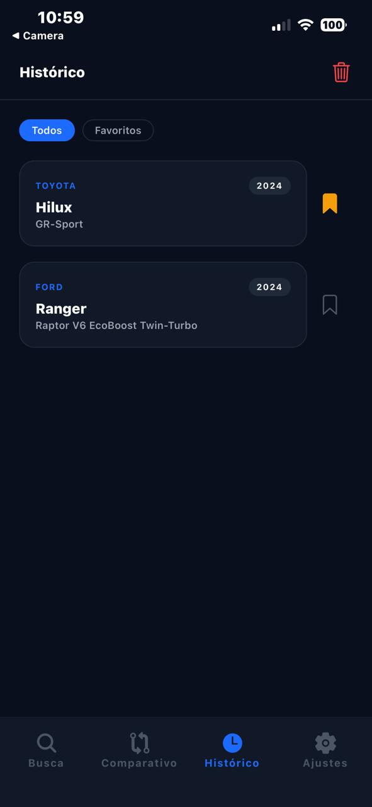
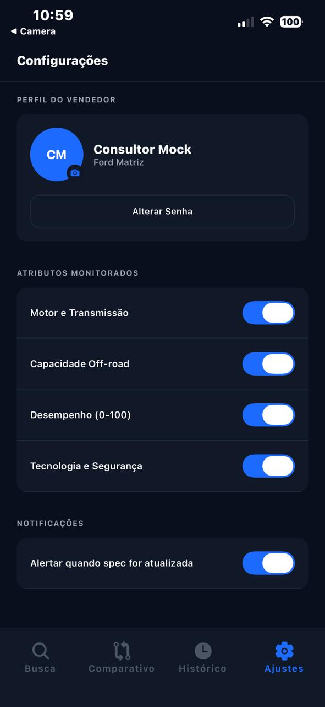
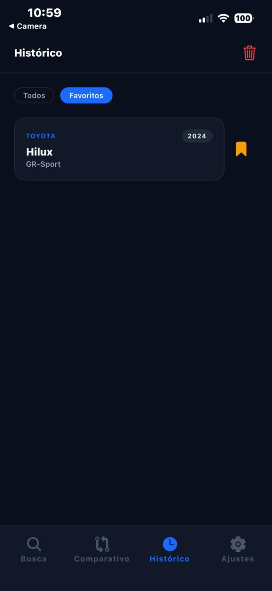

# Raptor Mobile 🦖 — Ford Challenge

O **Raptor Mobile** é uma solução móvel desenvolvida para o desafio da Ford, focada em transformar a experiência de venda no showroom. O aplicativo capacita consultores de vendas com informações técnicas instantâneas, comparativos de mercado e inteligência competitiva, tudo na palma da mão.

---
# [Video Apresentação](https://drive.google.com/file/d/1eCSflt-YermQjY4nSCSUoE1Dt4EQv3fp/view?usp=sharing)

## 📖 a) Sobre o Projeto

### O Desafio
Escolhemos o desafio de **Digitalização da Jornada de Vendas**. No cenário atual, os consultores muitas vezes precisam se ausentar para consultar manuais ou sistemas de mesa, quebrando o ritmo da negociação. O Raptor Mobile resolve isso trazendo mobilidade e autoridade para o vendedor no pátio da concessionária.

### Por que Mobile?
A mobilidade permite que o vendedor acompanhe o cliente durante todo o trajeto físico — desde a recepção até a inspeção do veículo no pátio — sem nunca perder o acesso aos dados que podem converter uma dúvida em fechamento.

### Funcionalidades Implementadas
- [x] **Autenticação Segura:** Login para consultores de vendas.
- [x] **Busca Inteligente:** Localização rápida de modelos Ford e concorrentes.
- [x] **Ficha Técnica Detalhada:** Visualização de especificações técnicas organizadas por categorias.
- [x] **Comparativo Side-by-Side:** Comparação direta entre dois veículos com indicadores de vitória.
- [x] **Gráfico de Radar:** Visualização gráfica de superioridade em pilares de performance.
- [x] **Histórico de Buscas:** Acesso rápido às últimas consultas realizadas com opção de limpeza.
- [x] **Favoritos:** Possibilidade de marcar veículos para consulta rápida.
- [x] **Perfil e Configurações:** Gestão de preferências do consultor e dados da concessionária.

---

## 👥 b) Integrantes do Grupo

| Nome Completo | RM |
| :--- | :--- |
| Giulia Rocha | 558084 |
| Gabriel Danius | 555747 |
| Caio Rossini | 555084 |
| Carlos Eduardo Ribeiro | 556785 |


---

## 🚀 c) Como Rodar o Projeto

### Pré-requisitos
- **Node.js** (versão 18 ou superior) & **npm/yarn**
- **Expo Go** instalado no seu dispositivo móvel (Android ou iOS)
- **Docker** instalado e em execução

### Passo a Passo

#### 1. Subir o Backend Completo (Docker)
O banco de dados e a API Java estão configurados para rodar juntos em containers.

1. Na raiz do projeto (`challenge-ford`), execute:
   ```bash
   docker-compose up -d
   ```
   *Isso iniciará o PostgreSQL e a Raptor API automaticamente. A API ficará disponível em `http://localhost:8080`.*

#### 2. Configurar e Rodar o Mobile
1. Acesse a pasta do mobile:
   ```bash
   cd raptor-mobile
   ```
2. Instale as dependências:
   ```bash
   npm install
   ```
3. **Conexão com a API (Opcional):**
   O app inicia por padrão com Mocks (offline). Para usar a API real que você acabou de subir no Docker, crie um arquivo `.env` na raiz da pasta `raptor-mobile`:
   ```env
   EXPO_PUBLIC_USE_MOCKS=false
   EXPO_PUBLIC_API_URL=http://<SEU_IP_LOCAL>:8080
   ```
   *(Dica: Use o seu IP local, ex: 192.168.x.x, para que o celular físico consiga encontrar o servidor).*

4. Inicie o projeto:
   ```bash
   npx expo start -c
   ```

#### 3. Executar no Dispositivo
Abra o app **Expo Go** no seu celular e escaneie o QR Code que aparecerá no terminal.

---

## 📱 d) Demonstração Visual

| Descrição da Tela | Visualização |
| :--- | :--- |
| **Login Screen**<br>Acesso seguro e autenticado para o consultor de vendas. |  |
| **Tela Principal**<br>Tela principal da aplicação com busca e histórico. |  |
| **Busca / Brand Selection**<br>Interface para seleção rápida de marcas e modelos. |  |
| **Ficha Técnica**<br>Informações detalhadas organizadas por categorias. |  |
| **Comparativo Side-by-Side**<br>Comparação direta com destaque para o vencedor. |  |
| **Gráfico de Radar**<br>Visualização analítica dos pilares de performance. |  |
| **Histórico de Buscas**<br>Registro das últimas consultas realizadas. |  |
| **Configurações**<br>Ajustes de preferências do aplicativo. |  |
| **Buscas Favoritas**<br>Buscas favoritadas para maior agilidade. |  |


---

 ## [Video Demo](https://drive.google.com/file/d/1vDC0GxZa1u_w0UlMN6sTU9v11CjtXf-P/view?usp=drive_link)

## 🛠️ e) Decisões Técnicas

### Stack Escolhida
- **React Native + Expo:** Escolhido pela agilidade de desenvolvimento e facilidade de deploy multiplataforma (iOS/Android) com uma única base de código.
- **TypeScript:** Utilizado para garantir segurança de tipos, reduzindo erros em tempo de execução e melhorando a manutenção.
- **Expo Router:** Implementação de navegação nativa baseada em arquivos, tornando o roteamento mais intuitivo.

### Estrutura e Arquitetura
O projeto segue a metodologia de **Atomic Design**, organizado da seguinte forma:
- `components/atoms`: Componentes básicos e indivisíveis (Badges, Buttons, Dividers).
- `components/molecules`: Combinação de átomos que formam unidades funcionais (VehicleCard, SpecRow, CompareRow).
- `components/organisms`: Componentes complexos que formam seções das páginas (CompareMatrix, RadarChart, SearchForm).

### Integrações
- **API Client (Axios):** Configurado para consumo de dados técnicos de veículos, com suporte a Mocks para desenvolvimento offline.
- **Context API:** Gerenciamento de estado global para Autenticação, Tema e seleção de veículos para comparação.
- **Async Storage:** Persistência local para o histórico de buscas e favoritos do consultor.

---

## 📈 f) Próximos Passos
Com mais tempo de desenvolvimento, o grupo implementaria:
1. **Modo Offline Total:** Sincronização prévia de dados para funcionamento em pátios sem qualquer sinal de internet.
2. **Integração com CRM Ford:** Envio automático de comparativos PDF diretamente para o lead do cliente no sistema da concessionária.
3. **Escaneamento de QR Code:** Identificação instantânea do veículo no showroom através de etiquetas inteligentes nas janelas.
